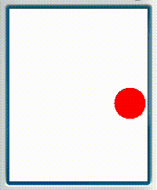
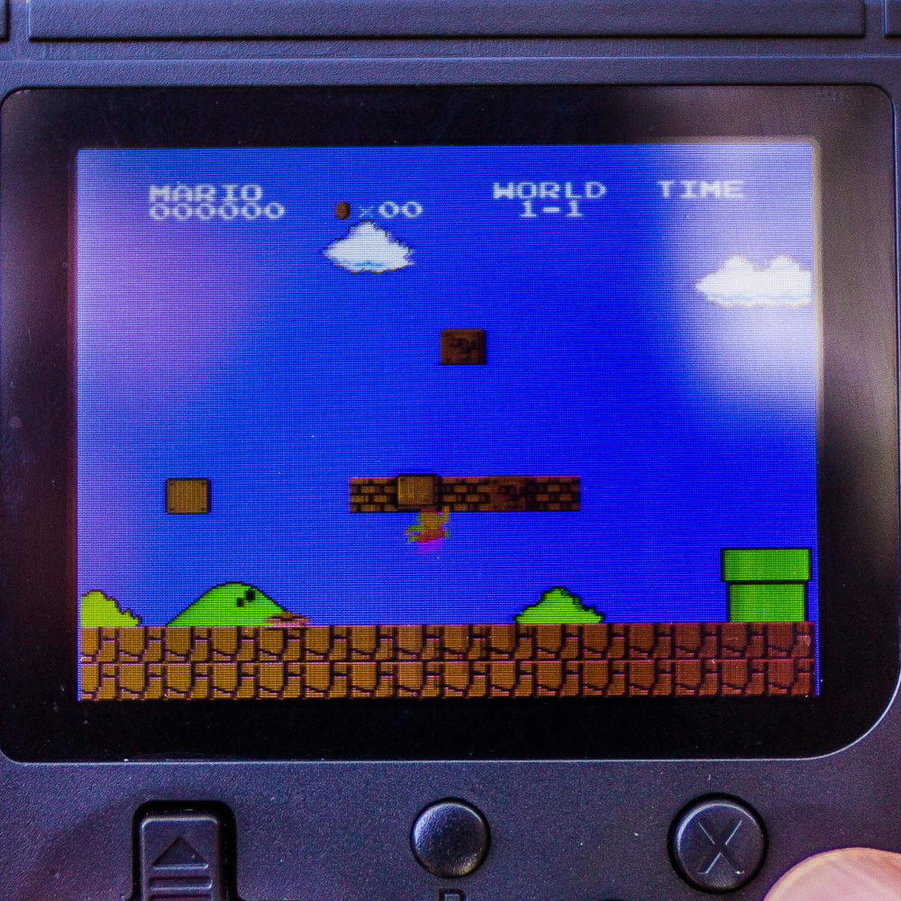
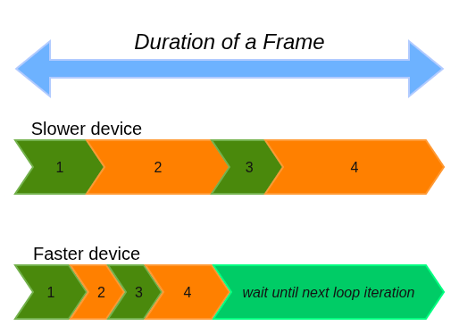

<a href="https://www.youtube.com/watch?v=v8qGenpuhks&t=33s" target="_blank"><h1>Frame rate stabilization</h1></a>



---

# Importance of Frame rate (FPS)

Frame rate is directly related to gameplay experience.

- When FPS is too low, the gameplay **appears lagging** (physics, animations, and input processing included).
- When FPS is too high, the gameplay appears smooth while the system **drains more energy**.
- Optimal FPS range varies from game to game.

---

# Suitable for high FPS

- Desktop and console games
- Real-time gameplay
- High-end graphics
- Realistic physics simulation

eg: AAA titles, fast-paced games, and _most modern games in general_


---

# Suitable for low FPS

- Mobile and hand-held games
- Turn-based gameplay
- Minimal animations
- Little physics simulation

eg: visual novels, deck-building games, point & click games, etc. 



---

<a href="https://www.youtube.com/watch?v=v8qGenpuhks&t=246s" target="_blank"><h1>How to stabilize FPS in J2ME?</h1></a>

> _A fast device can run slower, but a slow device can't run faster._

Ensure that your gameplay has consistent speed on fast devices as well as slow devices, using:

- a constant FPS (like 18 FPS)
- a controlled FPS range (like 15 to 30 FPS)

--- 

# Constant FPS technique



---

<style>
pre {
  background-color: #000;
}
</style>

# Constant FPS technique

```java
final float MSPF = 1000f/FPS;            // milliseconds taken per frame
long frameEnd = currentTime();

while (isRunning) {
    updatePhysics(MSPF);                 // assume Δt equals MSPF approx.
    drawStuff();
    ...
    frameEnd += MSPF                     // time when this frame ends
    long tz = frameEnd - currentTime();  // time left until this frame ends
    if (tz > 0) Thread.sleep(tz);                     
}
```

---

<a href="https://www.youtube.com/watch?v=v8qGenpuhks&t=582s" target="_blank"><h1>Code Demo</h1></a>

## ⚡⚡⚡

---

# Steps

1. Define a constant FPS
2. Update time-dependent code to use MSPF
3. Delay the game loop when necessary

---

<a href="/" target="_blank"><h1>The End</h1></a>

_💟 Thanks for giving your time!_
